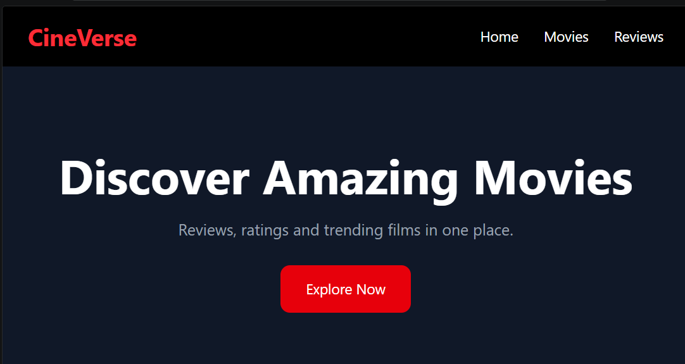
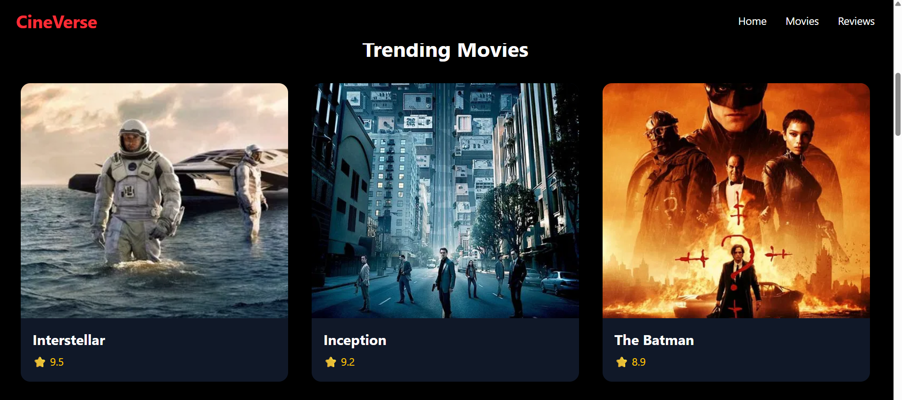
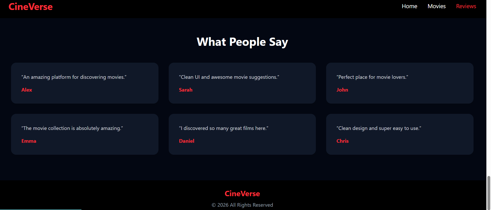

🎬 CineVerse

CineVerse is a simple and modern movie review landing page built using React.js and Tailwind CSS. The website showcases trending movies, ratings, and audience reviews through a clean and responsive dark-themed interface inspired by modern streaming platforms.

This project was created to practice React components, responsive web design, smooth scrolling navigation, reusable UI components, and modern frontend styling using Tailwind CSS.

---

✨ Features

- 🎥 Modern movie landing page UI
- 🌙 Dark themed responsive design
- ⭐ Trending movie cards with ratings
- 💬 Audience review section
- 🔄 Smooth scrolling navigation
- ⚛️ Reusable React components
- 📱 Fully responsive layout
- 🎨 Styled using Tailwind CSS
- ✨ Hover animations and transitions

---

🛠️ Tech Stack

- React.js
- Vite
- Tailwind CSS
- JavaScript
- HTML5
- CSS3

---

📂 Folder Structure

```bash
src/
│
├── components/
│   ├── Navbar.jsx
│   ├── Hero.jsx
│   ├── MovieCard.jsx
│   ├── MovieSection.jsx
│   ├── Reviews.jsx
│   └── Footer.jsx
│
├── assets/
├── App.jsx
├── main.jsx
└── index.css
```

---

🚀 Getting Started

Clone the Repository

```bash
git clone https://github.com/ftmarumaiza/cineverse.git
```

Navigate to Project Folder

```bash
cd cineverse
```

Install Dependencies

```bash
npm install
```

Run Development Server

```bash
npm run dev
```

---

🌐 Live Demo

https://cineverse-app-dvxx.vercel.app/

---

📌 GitHub Repository

https://github.com/ftmarumaiza/cineverse

---
📸 Screenshots

Home Page



Trending Movies Section



Reviews Section



📖 Project Description

CineVerse is a frontend React project developed to improve practical skills in React.js and Tailwind CSS. The project includes multiple sections such as a navigation bar, hero section, trending movie cards, audience reviews, and footer.

The landing page uses reusable React components and array mapping for displaying movie cards dynamically. Tailwind CSS is used to create a modern responsive UI with smooth hover effects, spacing, typography, and dark-themed styling.

This project demonstrates:

- Component-based architecture
- Responsive web design
- React props and mapping
- Smooth scrolling navigation
- Modern UI/UX practices

---

👩‍💻 Author

Fathima Rumaiza

GitHub:  
https://github.com/ftmarumaiza

---

⭐ Support

If you like this project, consider giving it a star on GitHub ⭐
